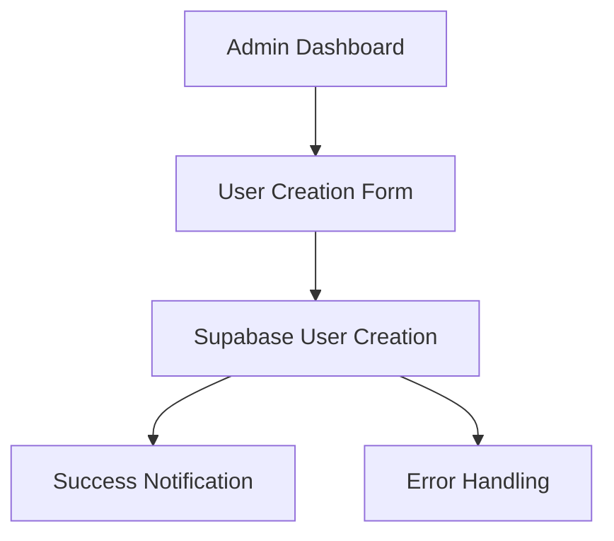

# Admin User Creation Form Specification

## 1. Technical Requirements
- Next.js 14.1.0
- React 18.2.0
- Supabase Auth (email/password + Google OAuth)
- shadcn/ui components
- Tailwind CSS styling

## 2. Required Dependencies
```bash
pnpm add @supabase/auth-helpers-nextjs @supabase/auth-ui-react @supabase/auth-ui-shared
pnpm add tailwindcss postcss autoprefixer
pnpm add @radix-ui/react-dialog @radix-ui/react-slot
```

## 3. Component Structure
1. `UserCreationForm.tsx` - Admin user creation form
2. `EmailAuth.tsx` - Email/password fields
3. `RoleSelector.tsx` - User role selection
4. `FormValidation.ts` - Validation utilities

## 4. User Creation Flow


## 5. Implementation Steps
1. Set up Tailwind CSS configuration
2. Install required dependencies
3. Create admin form components
4. Implement Supabase user creation API
5. Add form validation
6. Test user creation flow

## 6. Security Considerations
- Admin authentication required
- Role-based access control
- Secure API endpoints
- Input sanitization